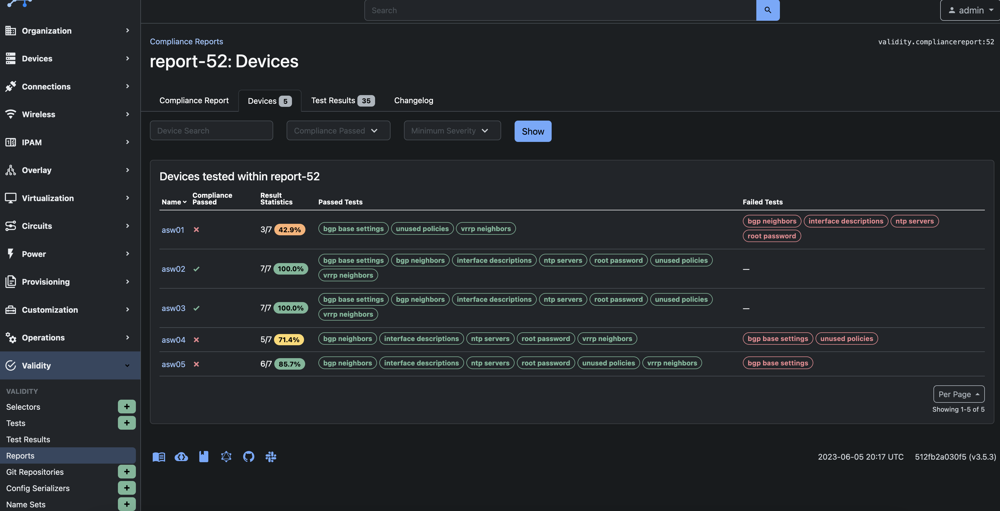
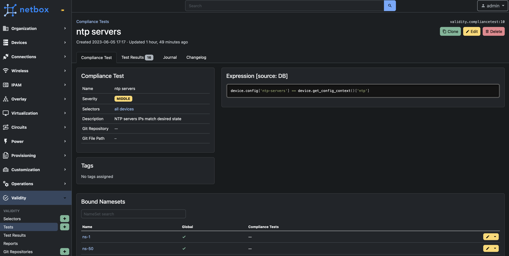
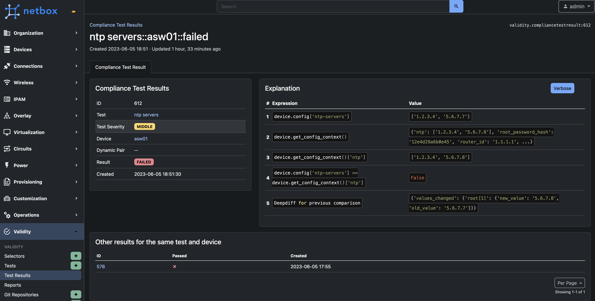
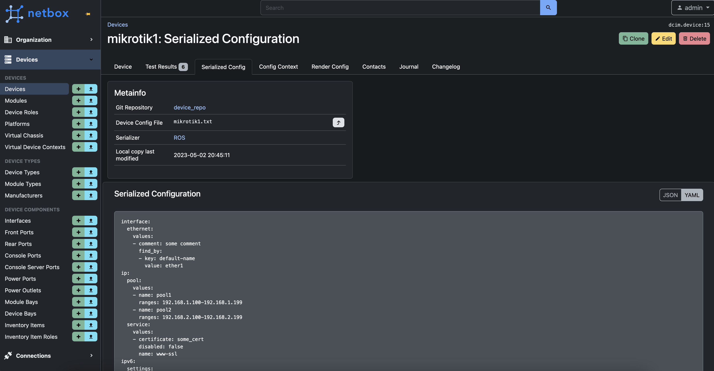

<div align="center">
    <a href="https://validity.readthedocs.io"></a>
    <h1>Validity: vendor-agnostic configuration compliance</h1>
    <p>
        
        
        
        
    </p>
</div>

<!--mkdocs-start-->
## What?
Validity is the [NetBox](https://netbox.dev) plugin to write "auto tests" for configuration. You define compliance tests and Validity checks network device configuration files against these tests. As a result you can find out which devices are provisioned properly (according to the tests you have written) and which are not.

To use validity you need:

1. Store configuration files of your devices in a Git repository. Validity does not collect the configs from your network, you have to do it by third-party tool (e.g. [oxidized](https://github.com/ytti/oxidized)).

2. Define [TTP Template](https://ttp.readthedocs.io/en/latest/) to translate the config from vendor specific format into JSON.

3. Write compliance test as a python expression, e.g.<br/>
`device.config["ntp-servers"] == ["1.2.3.4", "5.6.7.8"]`

4. Apply created test to specific devices and get the results per device (passed or failed).


## Why?
Configuration compliance is one of the very common problems that arises in every company with the growth of their network. Usually companies solve this problem with some kind of scripts that do all the things at the same time: they parse configs, apply some compliance logic and push the results into some DB or third-party OSS system. Usually after the addition of several vendors (or even several software revisions of one model) these scripts become unreadable and almost no one can definitely say which rules the script checks for.

Validity completely separates compliance test code from all other things like config serialization. This one encourages you to write short, clean and understandable compliance tests together with the mandatory description.


## Key Features
* Truly vendor-agnostic. You can easily integrate any vendor config format using [TTP](https://github.com/dmulyalin/ttp)
* Writing compliance tests using Python expressions and [JQ](https://stedolan.github.io/jq/manual/)
* Flexible selector system to apply the tests only to a specific subset of devices
* Concept of **dynamic pairs**. With dynamic pair you can compare 2 different devices between each other (e.g. compare the configuration of 2 MC-LAG members).
* **Test result explanation**. When some test fails, you can get the **explanation** of the calculation process step by step. It helps to identify the cause of the failure.
* **ORM access** inside the test. You have full access to the **device** properties. For instance, you may leverage [Configuration Contexts](https://docs.netbox.dev/en/stable/features/context-data/) NetBox feature to store your desired configuration and compare it with the config collected from the device.
* **Reports and webhooks**. After execution of some bunch of tests you can get the report with passed/failed statistics grouped by some Location/Site/Manufacturer/etc. Moreover, you can provision the webhook to notify an external system when compliance report is generated.
* **Test extensibility**. You can define your own python functions or classes to reuse the code between multiple compliance tests.
* Possibility to store all heavy text-based entities (like compliance tests or TTP Templates) in a **Git repository**

## Download and Install

You can download Validity via **pip**
```
pip install netbox-validity
```
After that follow the [installation guide](https://validity.readthedocs.io/en/latest/installation/) to correctly add Validity to your NetBox.
<!--mkdocs-end-->

## Documentation
Read the full documentation on [validity.readthedocs.io](https://validity.readthedocs.io)


## Quick Start

A short video about first steps with Validity:

[](https://youtu.be/Hs2IUE6rKC4)


## Contributing

Feel free to ask a [Question](https://github.com/amyasnikov/validity/discussions), report an [Issue](https://github.com/amyasnikov/validity/issues) or even make a [PR](CONTRIBUTING.md). Read more about contribution in the [CONTRIBUTING](CONTRIBUTING.md) guide.

## Screenshots








